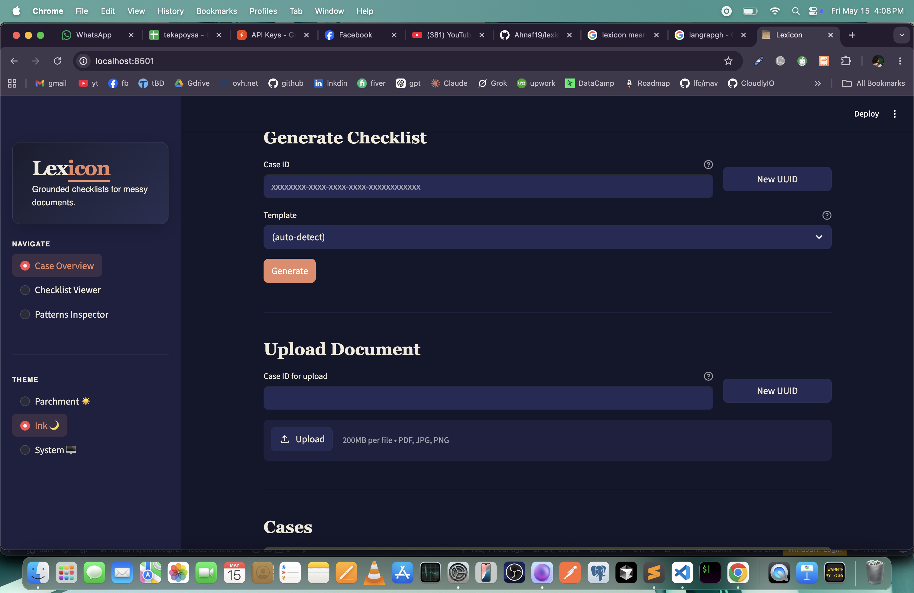

# Lexicon

_Grounded document-checklist generator for messy legal inputs._


---

Junior associates spend hours reading scanned PDFs, handwritten exhibits, and inconsistently-formatted contracts to assemble a checklist of what _should_ be in the file. Lexicon automates that — ingesting a folder of messy legal documents and producing a structured checklist where every item cites the exact page and character span that supports it. Ambiguous evidence is marked `unclear` rather than guessed; missing items stay `missing`. The operator reviews, corrects, and finalises — and each correction teaches the system to draft closer to their standard on the next similar matter.



---

## Highlights

- **Grounding is enforced, not hoped for.** A V1–V5 validation gate rejects hallucinated page references. `status="present"` requires non-empty evidence — it's a Pydantic constraint, not a policy. The SQL invariant `present ∧ evidence=∅` returns zero rows across every generation run.
- **Hybrid retrieval over messy inputs.** Dense pgvector cosine + sparse BM25 fused via Reciprocal Rank Fusion, with parent-section expansion so generation sees full clause context while citations anchor to the precise span.
- **The improvement loop is real.** Operator edits land as typed `EditEvent` rows. A single LLM call per finalized checklist distils corroborating edits into `LearnedPattern` rules. Promoted rules apply automatically on the next run — measured: mean edit distance 1.58 → 0.00 across four runs.
- **OCR triage, not a single engine.** Marker (Surya) handles clean and scanned PDFs in one path. Blocks below 0.6 confidence fall back to TrOCR for handwriting. Dense embeddings tolerate OCR noise — the handwritten exhibit was still retrieved at rank #2 despite garbled text.
- **No vendor lock-in.** Groq `llama-3.3-70b-versatile` (default, ~400 TPS, free-tier) and Ollama `qwen3:8b` (fully local) switch via a single env var. Same code, same prompt, different provider.

---

## Quickstart

> [!IMPORTANT]
> The only required credential is a free [Groq API key](https://console.groq.com). Everything else runs locally with Docker.

**1. Clone and configure**

```bash
git clone https://github.com/Ahnaf19/lexicon.git
cd lexicon
cp .env.template .env
# Set GROQ_API_KEY=gsk_... in .env
```

**2. Start Postgres and install dependencies**

```bash
docker compose up -d postgres
uv sync
uv run alembic upgrade head
```

**3. Ingest sample documents**

```bash
uv run python -m app.cli ingest samples/clean samples/degraded samples/handwritten
```

**4. Start the API and UI**

```bash
# Terminal 1
uv run uvicorn app.main:app --reload

# Terminal 2
uv run streamlit run ui/streamlit_app.py
```

API: `http://localhost:8000/docs` · UI: `http://localhost:8501`

> [!NOTE]
> **Loop result:** Run 4 reached 100% touch-free rate with mean edit distance 0.00 after one pattern promoted at corroboration=3. → [Full evaluation →](docs/EVALUATION.md)

---

## Explore the docs

| Document                              | What's inside                                                                                                                              |
| ------------------------------------- | ------------------------------------------------------------------------------------------------------------------------------------------ |
| [Architecture](docs/ARCHITECTURE.md)  | Pipeline diagram, per-layer component breakdown, LangGraph node map, V1–V5 invariants                                                      |
| [Data Flow](docs/DATA_FLOW.md)        | End-to-end walk of a single generation request — HTTP call through SSE stream to DB writes                                                 |
| [Design Decisions](docs/DECISIONS.md) | The six non-obvious choices: grounding invariant, parent expansion, provider strategy, OCR triage, corroboration gate, real-Postgres tests |
| [API Reference](docs/API.md)          | All 14 endpoints with curl examples and request/response shapes                                                                            |
| [Evaluation](docs/EVALUATION.md)      | Methodology, results table, loop closure analysis, raw JSON                                                                                |
| [Setup Guide](docs/SETUP.md)          | Full install path: Docker, uv, FastAPI, Streamlit, CLI, Windows, NVIDIA GPU                                                                |
| [Roadmap](docs/ROADMAP.md)            | Known limitations, what ships next, and deliberately deferred scope                                                                        |

---

_MIT License_
